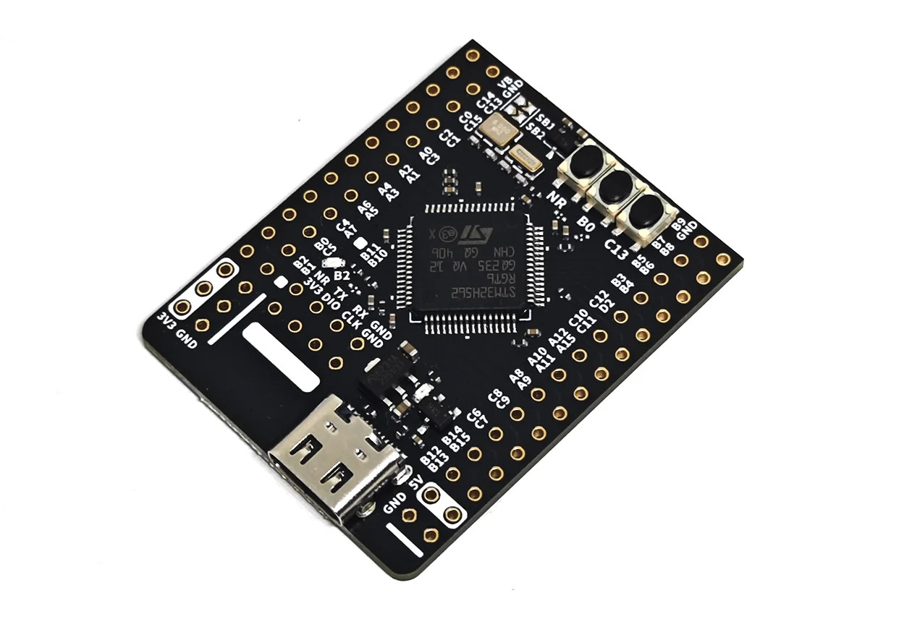

**********************************************************************
Board files to compile MicroPython for the WeAct STM32F405RGT6 Pyboard 
**********************************************************************

Background
**********

   The WeAct STM32H562RGT6 Pyboard.
   

This repository provides board support and build instructions for running MicroPython 
on the WEACT_H562RGT6 (STM32H562RG) Pyboard.

Quick Start: Build and Flash MicroPython Firmware
-------------------------------------------------

Follow these steps to build and flash MicroPython for the WEACT_H562RGT6 board.

.. contents::
    :local:
    :depth: 1

Prerequisites
~~~~~~~~~~~~~

- Ubuntu/Debian (or similar), macOS, or WSL (Windows Subsystem for Linux)
- Git
- GNU Make
- ARM GCC toolchain (e.g., ``gcc-arm-none-eabi``)
- ``st-flash`` or STM32CubeProgrammer for flashing

Install Required Packages (Ubuntu/Debian example)
~~~~~~~~~~~~~~~~~~~~~~~~~~~~~~~~~~~~~~~~~~~~~~~~~

.. code-block:: bash

    sudo apt update
    sudo apt install -y git make gcc-arm-none-eabi libnewlib-arm-none-eabi build-essential

Clone MicroPython and Submodules
~~~~~~~~~~~~~~~~~~~~~~~~~~~~~~~

.. code-block:: bash

    git clone https://github.com/micropython/micropython.git
    cd micropython
    git submodule update --init --recursive

(Optional) Checkout a Specific MicroPython Version
~~~~~~~~~~~~~~~~~~~~~~~~~~~~~~~~~~~~~~~~~~~~~~~~~~

.. code-block:: bash

    # For example, to use v1.22.0:
    git checkout v1.22.0
    git submodule update --init --recursive

Add the Board Definition
~~~~~~~~~~~~~~~~~~~~~~~~

Copy or create your board definition in:

::

    ports/stm32/boards/WEACT_H562RGT6/

You will need at least the following files:

- ``mpconfigboard.h``
- ``mpconfigboard.mk``
- ``pins.csv``
- ``stm32h562_af.csv``
- ``stm32h562rg.ld``

Build the MicroPython Cross Compiler
~~~~~~~~~~~~~~~~~~~~~~~~~~~~~~~~~~~~

.. code-block:: bash

    make -C mpy-cross

Build MicroPython for WEACT_H562RGT6
~~~~~~~~~~~~~~~~~~~~~~~~~~~~~~~~~~~~~

.. code-block:: bash

    cd ports/stm32
    make BOARD=WEACT_H562RGT6

The output firmware will be in:

::

    build-WEACT_H562RGT6/firmware.hex
    build-WEACT_H562RGT6/firmware.bin

Flash the Firmware
~~~~~~~~~~~~~~~~~~

Use your preferred STM32 flashing tool. Example using ``st-flash``:

.. code-block:: bash

    st-flash write build-WEACT_H562RGT6/firmware.bin 0x08000000

If using STM32CubeProgrammer or DFU, refer to their documentation.

Troubleshooting
~~~~~~~~~~~~~~~

- If you change board files or the linker script, run:

  .. code-block:: bash

      make BOARD=WEACT_H562RGT6 clean

  before rebuilding.

- For build errors about missing symbols, ensure your ``stm32h562rg.ld`` linker script includes the required MicroPython flash storage symbols (see board documentation or upstream examples).
- For serial REPL access, connect to the board's USB or UART port and use a terminal program (e.g., ``rshell``, ``picocom``, ``minicom``, or ``screen``).

Status
******

This is a first release and while the board can be successfully flashed and the 
REPL is available (from rshell), no extensive testing has been done, particularly 
as regards pin definitions.

Support & Liability
*******************

This project comes with no promise of support or acceptance of liability. Use at
your own risk.

Copyright & License
*******************

All contents Copyright 2020-2025 by Murray Altheim. All rights reserved.

Software and documentation are distributed under the MIT License, see LICENSE
file included with project.

